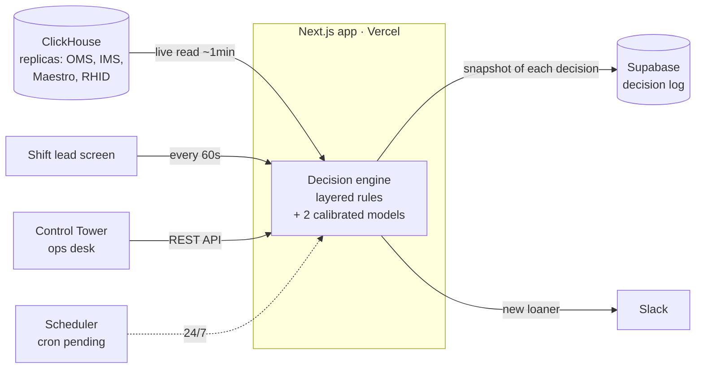
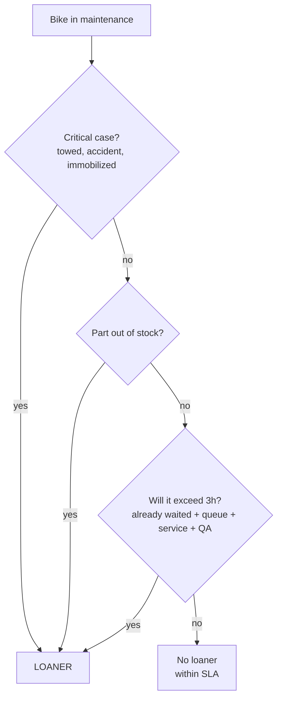

<div align="center">

[🇧🇷 Português](README.md) · **🇬🇧 English**

# 🛵 RIVERS

**Decides, in real time and with a justification, which customers in maintenance should get a loaner bike.**

[](https://nextjs.org)
[](https://react.dev)
[](https://www.typescriptlang.org)
[](https://vammo-reserva.vercel.app)
[](https://clickhouse.com)
[](https://supabase.com)

[Live app](https://vammo-reserva.vercel.app) · [How it works](docs/COMO-FUNCIONA.md) · [Concepts](docs/RIVERS-CONCEITOS.md) · [Reports](calib/)

</div>

> **Note:** the code and the app UI are in Portuguese (Vammo is a Brazilian company). This README is the English entry point; the deeper docs under `docs/` are in Portuguese.

---

## The problem

When a Vammo customer drops their bike off for maintenance, the policy is clear: if the repair will take more than **3 hours**, they get a **loaner bike** so they don't lose their workday. In practice, though, this decision was manual — the shift lead eyeballed it while juggling a hundred other things. The result: it depended on who was on shift, it came late (often only after the customer had already complained), and no one could explain the criteria.

## What RIVERS does

It **continuously** evaluates every bike on the shop floor (Mooca, Osasco, SBC), decides whether each one will blow past the 3h mark — and **always explains why** in plain, readable text. The decision fires right after diagnosis, anticipating the problem instead of reacting to it.

Core design decision: it's a **deterministic rule-based algorithm**, not a black box. Operations needs to be able to audit and challenge every decision. Machine learning comes in where it adds value without turning into magic — **calibrating the numbers** that feed the rules.

## Architecture



The engine is **reactive**: it runs when something calls it (the screen, the ops desk, or the cron). Every decision is stored with a full snapshot of what the algorithm saw — that's what makes it auditable and lets us measure accuracy afterwards.

## How it decides

Every rule answers the same question — *"will it be ready within 3h?"* — and runs in layers, where the **first one that fires wins**:



At its core there are **two criteria** (time and parts) plus the obvious cases. The time calculation is where the engineering lives — and it relies on two models.

## The two models

### 1. Service time — non-negative least squares (NNLS)

The part-time catalog was broken (lots of parts with zero time), so we **learned the times from history**: a least-squares regression with non-negative coefficients over thousands of completed work orders. The target is the real hands-on (ramp) time; the features are the parts replaced; the coefficients that come out are the **minutes per part**, plus an intercept (fixed cost per work order). Validation uses a **temporal split** (train on the past, test on the most recent days) — and it beats the old formula on the metric that matters: classifying which bikes exceed 3h.

> ⚠️ Known limitation: the model is **additive** — it sums the time of each part — but a mechanic does several in parallel in the same teardown. It overestimates on multi-part bikes; a fix (sublinear discount) is on the roadmap.

Code: [`scripts/calibra-tempo.mjs`](scripts/calibra-tempo.mjs) → generates [`src/lib/tempo-pecas.ts`](src/lib/tempo-pecas.ts).

### 2. Shop capacity — conditional mean vs. schedule

To estimate the queue, RIVERS needs to know how many mechanics are actually producing per base and hour. The intuition is **queueing theory**: wait ≈ accumulated work ÷ service rate. We tested two estimators:

- **Conditional mean** (seasonal baseline): the average of mechanics actually active, grouped by base × day-of-week × hour. Non-parametric, captures lunch and shift changes on its own. It's what feeds the [`/capacidade`](https://vammo-reserva.vercel.app/capacidade) screen as a *mirror* — using **leave-one-out** validation so it doesn't cheat.
- **RHID schedule** × correction factor: who's rostered on the time clock, discounted by the fraction that isn't actually on the ramp. This is what the **engine** uses.

In an honest backtest the conditional mean had a smaller error — but we chose the **schedule** anyway, because the mechanic headcount is growing fast and a historical average lags behind, while the schedule reflects the present. A conscious, [documented](docs/DECISOES.md) trade-off.

## How we know it works

Accuracy here isn't an opinion. We cross-check, bike by bike: **what RIVERS suggested** × **what the shop actually did** (recorded in Maestro) × **the real outcome** (did the bike exceed 3h?).

> The ruler that matters: we measure the time **until the bike is ready**, not until the customer picks it up — because a customer holding a loaner is in no hurry to return, which used to distort the count.

In the first 15 days, RIVERS **captured the large majority** of the loaners the shop gave, **flagged them before** the human decision in most cases, and the few misses were investigated one by one: none was a calculation error — it was the engine not "looking" at the right moment (which the cron fixes). Full reports, with methodology and caveats, are in [`calib/`](calib/).

## Project structure

```
src/
├── app/
│   ├── page.tsx              # Shift lead screen (evaluates + logs + notifies every 60s)
│   ├── capacidade/           # Capacity model monitor (predicted x actual)
│   ├── acuracia/             # Accuracy panel (cross-check with Maestro)
│   └── api/
│       ├── os/               # Evaluates all active work orders (screen endpoint)
│       ├── cron/             # Same engine, for the scheduler (Bearer secret)
│       ├── recomendacoes/    # REST API consumed by the Control Tower (x-api-key)
│       ├── capacity/         # Data for the capacity monitor
│       ├── accuracy/         # Data for the accuracy panel
│       └── feedback/         # Accept/reject from the screen
├── lib/
│   ├── algorithm.ts          # The rules (the "brain") — deterministic, testable
│   ├── rivers-engine.ts      # Orchestration: queries + capacity + logging
│   ├── tempo-pecas.ts        # Minutes per part (GENERATED by calibration — don't edit by hand)
│   ├── clickhouse.ts         # ClickHouse read client
│   ├── supabase.ts           # Decision log + dedup
│   └── slack.ts              # New-loaner notification
└── types/

scripts/    # Calibration and analysis (see scripts/README.md)
docs/       # Living docs (concepts, decisions, models, how it works) — in Portuguese
calib/      # Reports (HTML) and analysis outputs
supabase/   # Schema (DDL) for the log tables
```

## Running locally

```bash
npm install
# create .env.local with the variables below
npm run dev            # http://localhost:3000
```

The app reads ClickHouse live, so it needs the credentials to actually work.

### Environment variables

| Variable | For |
|---|---|
| `CLICKHOUSE_HOST` / `CLICKHOUSE_USER` / `CLICKHOUSE_PASSWORD` | Reading the data (work orders, parts, stock, schedule) |
| `NEXT_PUBLIC_SUPABASE_URL` / `SUPABASE_SERVICE_ROLE_KEY` | Decision log |
| `SLACK_WEBHOOK_URL` | New-loaner notification |
| `RIVERS_API_KEY` | Key for the API consumed by the Control Tower |
| `CRON_SECRET` | Protects the scheduler endpoint |

## Documentation

The deeper docs are in Portuguese:

| Doc | For |
|---|---|
| [`docs/RIVERS-CONCEITOS.md`](docs/RIVERS-CONCEITOS.md) | Understand the logic and the **why** behind each choice (no jargon) |
| [`docs/COMO-FUNCIONA.md`](docs/COMO-FUNCIONA.md) | Full system reference |
| [`docs/RIVERS-DEEP-DIVE.md`](docs/RIVERS-DEEP-DIVE.md) | Engineering/data level: queries, methods, failure modes |
| [`docs/DECISOES.md`](docs/DECISOES.md) | Design decision log and trade-offs |

## Status & roadmap

RIVERS is **in production** across the 3 bases, measuring accuracy against Maestro. Next steps:

- [ ] **Scheduler (cron)** — today the engine only runs while the screen is open; the cron makes it run 24/7
- [ ] **Recalibration** — multi-part discount on time + Osasco queue
- [ ] **Governance** — mandatory reason logging when a loaner is handed over

## Stack

**Next.js 16** · **React 19** · **TypeScript** · **Tailwind 4** — serverless deploy on **Vercel**. Data via **ClickHouse** (peerdb replicas, live read). Decision log in **Supabase** (Postgres). Calibration and analysis in **Node** + **Python**.

<div align="center"><sub>Vammo · Data & Analytics</sub></div>
