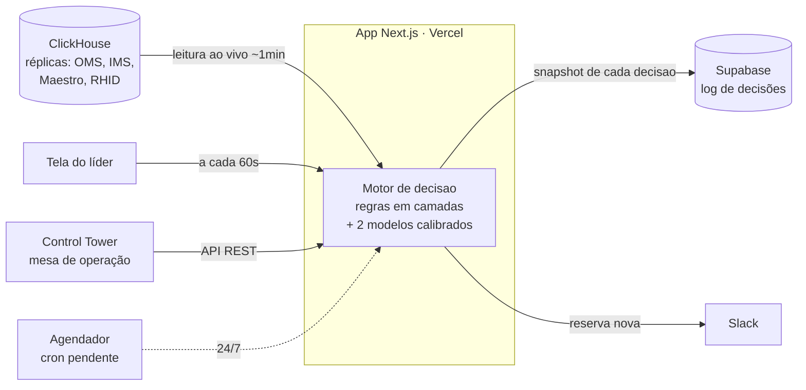
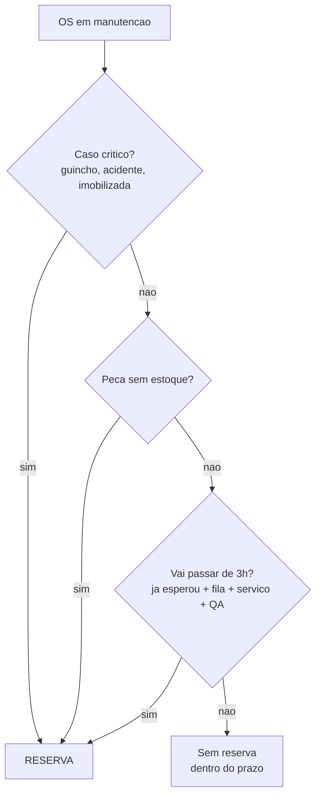

<div align="center">

**🇧🇷 Português** · [🇬🇧 English](README.en.md)

# 🛵 RIVERS

**Decide, em tempo real e com justificativa, quais clientes em manutenção devem receber uma moto reserva.**

[](https://nextjs.org)
[](https://react.dev)
[](https://www.typescriptlang.org)
[](https://vammo-reserva.vercel.app)
[](https://clickhouse.com)
[](https://supabase.com)

[App ao vivo](https://vammo-reserva.vercel.app) · [Como funciona](docs/COMO-FUNCIONA.md) · [Conceitos](docs/RIVERS-CONCEITOS.md) · [Relatórios](calib/)

</div>

---

## O problema

Quando um cliente da Vammo deixa a moto na oficina, a política é clara: se o conserto passar de **3 horas**, ele recebe uma **moto reserva** para não ficar sem trabalhar. Só que, na prática, essa decisão era manual — o líder de turno decidia no olho, no meio de mil tarefas. Resultado: dependia de quem estava de plantão, saía tarde (muitas vezes só depois de o cliente reclamar), e ninguém sabia explicar o critério.

## O que o RIVERS faz

Avalia **continuamente** todas as motos em piso (Mooca, Osasco, SBC), decide se cada uma vai estourar as 3h — e **sempre explica o porquê** em texto legível. A decisão sai logo após o diagnóstico, antecipando o problema em vez de reagir a ele.

Decisão de projeto central: é um **algoritmo determinístico de regras**, não uma caixa-preta. A operação precisa poder auditar e contestar cada decisão. O aprendizado de máquina entra onde agrega sem virar mágica — **calibrando os números** que alimentam as regras.

## Arquitetura



O motor é **reativo**: roda quando alguém chama (a tela, a mesa, ou o cron). Cada decisão é gravada com um snapshot completo do que o algoritmo enxergou — é isso que torna tudo auditável e permite medir acurácia depois.

## Como ele decide

Toda regra responde à mesma pergunta — *"fica pronta em 3h?"* — e roda em camadas, onde a **primeira que dispara decide**:



No fundo são **dois critérios** (tempo e peça) mais os casos óbvios. A conta de tempo é onde mora a engenharia — e depende de dois modelos.

## Os dois modelos

### 1. Tempo de serviço — regressão não-negativa (NNLS)

O cadastro de tempos de peça estava furado (muita peça zerada), então **aprendemos os tempos do histórico**: uma regressão de mínimos quadrados com coeficientes não-negativos sobre milhares de ordens de serviço concluídas. O alvo é o tempo real de rampa; as variáveis são as peças trocadas; os coeficientes que saem são os **minutos por peça**, mais um intercepto (custo fixo por OS). Validação com **separação temporal** (treina no passado, testa nos últimos dias) — e supera a fórmula antiga na métrica que importa: classificar quem passa de 3h.

> ⚠️ Limitação conhecida: o modelo é **aditivo** — soma o tempo de cada peça — mas o mecânico faz várias em paralelo na mesma desmontagem. Superestima em moto multi-peça; correção (desconto sublinear) no roadmap.

Código: [`scripts/calibra-tempo.mjs`](scripts/calibra-tempo.mjs) → gera [`src/lib/tempo-pecas.ts`](src/lib/tempo-pecas.ts).

### 2. Capacidade da oficina — média condicional vs. escala

Para estimar a fila, o RIVERS precisa saber quantos mecânicos estão produzindo por base e hora. A intuição é de **teoria de filas**: espera ≈ trabalho acumulado ÷ ritmo de atendimento. Testamos dois estimadores:

- **Média condicional** (baseline sazonal): a média de mecânicos realmente ativos, agrupada por base × dia-da-semana × hora. Não-paramétrico, captura almoço e troca de turno sozinho. É o que alimenta a tela [`/capacidade`](https://vammo-reserva.vercel.app/capacidade) como *espelho* — usando validação **leave-one-out** para não trapacear.
- **Escala do RHID** × fator de correção: quem está escalado no ponto, descontado da fração que não está de fato na rampa. É o que o **motor** usa.

No backtest honesto a média condicional errou menos — mas escolhemos a **escala** mesmo assim, porque o quadro de mecânicos cresce rápido e a média histórica fica atrasada, enquanto a escala reflete o presente. Trade-off consciente e [documentado](docs/DECISOES.md).

## Como sabemos que funciona

Acurácia aqui não é opinião. Cruzamos, moto a moto: **o que o RIVERS sugeriu** × **o que a oficina fez** (registrado no Maestro) × **o desfecho real** (a moto passou de 3h?).

> Régua que importa: medimos o tempo **até a moto ficar pronta**, não até o cliente buscar — porque cliente com reserva na mão não tem pressa de devolver, o que distorcia a conta.

Nos primeiros 15 dias, o RIVERS **capturou a grande maioria** das reservas que a oficina deu, **apontou antes** da decisão humana na maior parte dos casos, e os poucos furos foram investigados um a um: nenhum foi erro de conta — foi o motor não estar "olhando" na hora certa (o que o cron resolve). Os relatórios completos, com método e ressalvas, estão em [`calib/`](calib/).

## Estrutura do projeto

```
src/
├── app/
│   ├── page.tsx              # Tela do líder (avalia + loga + notifica a cada 60s)
│   ├── capacidade/           # Monitor do modelo de capacidade (estimado x real)
│   ├── acuracia/             # Painel de acurácia (cruzamento com o Maestro)
│   └── api/
│       ├── os/               # Avalia todas as OS ativas (endpoint da tela)
│       ├── cron/             # Mesmo motor, para o agendador (Bearer secret)
│       ├── recomendacoes/    # API REST consumida pelo Control Tower (x-api-key)
│       ├── capacity/         # Dados do monitor de capacidade
│       ├── accuracy/         # Dados do painel de acurácia
│       └── feedback/         # Aceitar/rejeitar da tela
├── lib/
│   ├── algorithm.ts          # As regras (o "cérebro") — determinístico, testável
│   ├── rivers-engine.ts      # Orquestração: queries + capacidade + log
│   ├── tempo-pecas.ts        # Minutos por peça (GERADO pela calibração — não editar à mão)
│   ├── clickhouse.ts         # Cliente de leitura do ClickHouse
│   ├── supabase.ts           # Log de decisões + dedup
│   └── slack.ts              # Notificação de reserva nova
└── types/

scripts/    # Calibração e análise (ver scripts/README.md)
docs/       # Documentação viva (conceitos, decisões, modelos, como funciona)
calib/      # Relatórios (HTML) e saídas das análises
supabase/   # Schema (DDL) das tabelas de log
```

## Rodando localmente

```bash
npm install
# crie .env.local com as variáveis abaixo
npm run dev            # http://localhost:3000
```

O app lê o ClickHouse ao vivo, então precisa das credenciais para funcionar de verdade.

### Variáveis de ambiente

| Variável | Para quê |
|---|---|
| `CLICKHOUSE_HOST` / `CLICKHOUSE_USER` / `CLICKHOUSE_PASSWORD` | Leitura dos dados (OS, peças, estoque, escala) |
| `NEXT_PUBLIC_SUPABASE_URL` / `SUPABASE_SERVICE_ROLE_KEY` | Log de decisões |
| `SLACK_WEBHOOK_URL` | Notificação de reserva nova |
| `RIVERS_API_KEY` | Chave da API consumida pelo Control Tower |
| `CRON_SECRET` | Protege o endpoint do agendador |

## Documentação

| Doc | Para quem |
|---|---|
| [`docs/RIVERS-CONCEITOS.md`](docs/RIVERS-CONCEITOS.md) | Entender a lógica e o **porquê** de cada escolha (sem jargão) |
| [`docs/COMO-FUNCIONA.md`](docs/COMO-FUNCIONA.md) | Referência completa do sistema |
| [`docs/RIVERS-DEEP-DIVE.md`](docs/RIVERS-DEEP-DIVE.md) | Nível engenharia/data: queries, métodos, casos de falha |
| [`docs/DECISOES.md`](docs/DECISOES.md) | Log de decisões de design e trade-offs |

## Status & roadmap

O RIVERS está **em produção** nas 3 bases, medindo acurácia contra o Maestro. Próximos passos:

- [ ] **Agendador (cron)** — hoje o motor só roda com a tela aberta; o cron faz rodar 24/7
- [ ] **Recalibração** — desconto multi-peça no tempo + fila de Osasco
- [ ] **Governança** — registro de motivo obrigatório na entrega da reserva

## Stack

**Next.js 16** · **React 19** · **TypeScript** · **Tailwind 4** — deploy serverless na **Vercel**. Dados via **ClickHouse** (réplicas peerdb, leitura ao vivo). Log de decisões em **Supabase** (Postgres). Calibração e análise em **Node** + **Python**.

<div align="center"><sub>Vammo · Data & Analytics</sub></div>
